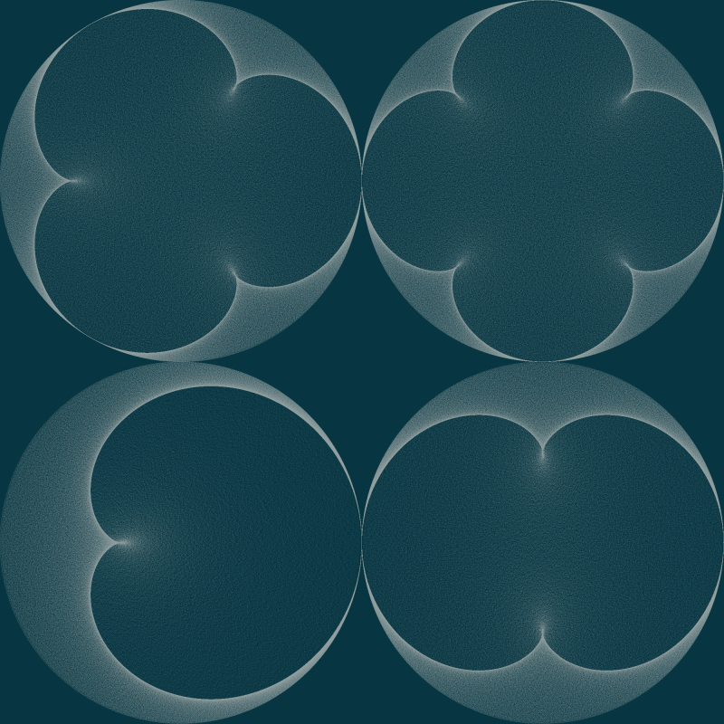

# Darude: `sandpaint`-esque image generation

Darude represents my attempt to do two things:

1. learn Rust
2. understand the magic of [Anders Hoff](http://inconvergent.net/)'s generative art library, [snek](https://github.com/inconvergent/snek)

It's definitely not designed for public consumption.
